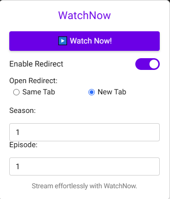

# IMDb Quick Watch



IMDb Quick Watch is a Tampermonkey userscript that allows users to quickly redirect IMDb and TMDB title pages to [vidbinge.dev](https://vidbinge.dev) with customizable settings such as redirect target (same tab or new tab) and specifying season and episode numbers for TV series.

## 🚀 Features

- **Easy Redirection**: Redirect IMDb and TMDB titles directly to vidbinge.dev.
- **Customizable Settings**:
  - **Redirect Target**: Choose to open the redirect in the same tab or a new tab.
  - **Season & Episode**: Specify season and episode numbers for TV series.
- **User-Friendly Interface**: Interactive UI integrated directly into IMDb and TMDB pages.
- **Feedback Notifications**: Receive snackbar notifications for actions and errors.

## 📥 Installation

### Prerequisites

- **Tampermonkey**: Ensure you have the [Tampermonkey](https://www.tampermonkey.net/) extension installed in your browser.

### Steps

1. **Clone the Repository**:

   ```bash
   git clone https://github.com/bitgineer/WatchNow-IMDb-TMDB.git
   ```

2. **Install the Userscript**:

   - Open the `imdb-quick-watch.user.js`
   - Tampermonkey should automatically detect the script. Click on the **Install** button in the Tampermonkey popup.

3. **Verify Installation**:

   - Navigate to any IMDb or TMDB title page.
   - The **IMDb Quick Watch** UI should appear at the bottom-right corner of the page.

## 🛠️ Usage

1. **Enable Redirect**:

   - Toggle the **Enable Redirect** switch to activate redirection settings.

2. **Configure Redirect Options**:

   - **Open Redirect**:
     - **Same Tab**: Redirects in the current tab.
     - **New Tab**: Opens the redirect in a new browser tab.
   - **Season & Episode**:
     - Specify the desired season and episode numbers (applicable for TV series).

3. **Initiate Redirection**:

   - Click the **Watch Now!** button to perform the redirection based on your settings.

4. **Feedback**:

   - Snackbar notifications will appear at the bottom of the screen to inform you about the status of your actions.

## 🖼️ Screenshots


*The IMDb Quick Watch UI integrated into an IMDb title page.*

## 🤝 Contributing

Contributions are welcome! Please follow these steps to contribute:

1. **Fork the Repository**.
2. **Create a Feature Branch**:

   ```bash
   git checkout -b feature/YourFeature
   ```

3. **Commit Your Changes**:

   ```bash
   git commit -m "Add Your Feature"
   ```

4. **Push to the Branch**:

   ```bash
   git push origin feature/YourFeature
   ```

5. **Open a Pull Request**.

## 📜 License

This project is licensed under the [MIT License](LICENSE).

## 📧 Contact

For any inquiries or feedback, please contact [bitgineer@use.startmail.com](mailto:bitgineer@use.startmail.com).

## Reporting Issues

If you encounter any issues or have suggestions, please open an [Issue](https://github.com/bitgineer/WatchNow-IMDb-TMDB/issues) with detailed information.

## License

By contributing, you agree that your contributions will be licensed under the [MIT License](LICENSE).

