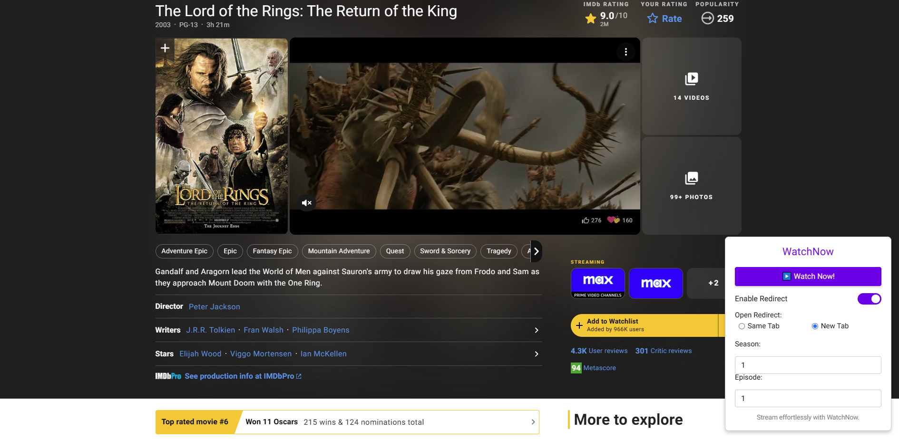

# WatchNow IMDb TMDB


**WatchNow IMDb TMDB** is a powerful Tampermonkey script that enhances your streaming experience by allowing you to quickly redirect from IMDb and TMDB title pages to [vidbinge.dev](https://vidbinge.dev). With customizable settings, you can manage how and where the redirection occurs, ensuring a seamless and efficient way to watch your favorite movies and TV series.


## Table of Contents

- [WatchNow IMDb TMDB](#watchnow-imdb-tmdb)
  - [Table of Contents](#table-of-contents)
  - [Description](#description)
  - [Features](#features)
  - [Installation](#installation)
  - [Usage](#usage)
  - [Screenshots](#screenshots)
  - [Contributing](#contributing)
  - [License](#license)
  - [Support](#support)

## Description

**WatchNow IMDb TMDB** is designed to streamline your movie and TV series watching process by providing an easy-to-use interface directly on IMDb and TMDB title pages. Whether you're browsing through movies or diving into TV series, WatchNow ensures you can quickly access streaming options with just a few clicks.

## Features

- **Easy Installation**: Install the script via Tampermonkey with minimal effort.
- **Custom Redirect Options**: Choose to open redirects in the same tab or a new tab.
- **Season and Episode Selection**: For TV series, specify the desired season and episode numbers.
- **User-Friendly Interface**: Intuitive UI with toggle switches and input fields.
- **Snackbar Notifications**: Receive instant feedback on your actions.
- **Responsive Design**: Compatible with various screen sizes for optimal viewing.

## Installation

### Prerequisites

- **Tampermonkey Extension**: Ensure you have the Tampermonkey extension installed in your browser.

  - [Download Tampermonkey for Chrome](https://tampermonkey.net/?ext=dhdg&browser=chrome)
  - [Download Tampermonkey for Firefox](https://tampermonkey.net/?ext=dhdg&browser=firefox)
  - [Download Tampermonkey for Other Browsers](https://tampermonkey.net/)

### Steps

1. **Clone the Repository**

   ```bash
   git clone https://github.com/bitgineer/WatchNow-IMDb-TMDB.git
   ```

2. **Locate the Script**

   Navigate to the cloned repository and find the script file renamed to include "WatchNow":

   ```
   WatchNow-IMDb-TMDB/
   ├── assets/
   │   └── screenshots/
   │       ├── ui-screenshot.png
   │       └── ui2-screenshot.png
   └── WatchNow-IMDb&TMDB.user.js
   ```

3. **Install the Script in Tampermonkey**

   - Open your browser and click on the Tampermonkey icon.
   - Select **Dashboard**.
   - Click on the **+** button to create a new script.
   - Delete any existing template code in the editor.
   - Open the `WatchNow-IMDb&TMDB.user.js` file from the cloned repository in a text editor.
   - Copy the entire script content and paste it into the Tampermonkey editor.
   - Click **File** > **Save** or press `Ctrl+S` (`Cmd+S` on Mac) to save the script.

4. **Verify Installation**

   - Navigate to any IMDb or TMDB title page.
   - The **WatchNow** UI should appear, allowing you to customize your redirection settings.

## Usage

1. **Access the UI**

   On any IMDb or TMDB title page, the **WatchNow** interface will appear, typically at the bottom-right corner of the page.

2. **Enable Redirect**

   - Toggle the **Enable Redirect** switch to activate the redirection settings.

3. **Set Redirect Preferences**

   - **Redirect Target**: Choose between opening the redirect in the same tab or a new tab.
   - **Season and Episode**: If the title is a TV series, specify the desired season and episode numbers.

4. **Initiate Redirect**

   - Click the **Watch Now!** button to perform the redirection based on your settings.

5. **Receive Feedback**

   - Snackbar notifications will appear at the bottom of the screen to inform you about the status of your actions (e.g., successful redirection, errors).

## Screenshots




## Contributing

Contributions are welcome! If you have suggestions, bug reports, or feature requests, please open an issue or submit a pull request.

### Steps to Contribute

1. **Fork the Repository**

   Click the **Fork** button at the top-right corner of this page to create a copy of the repository under your GitHub account.

2. **Clone Your Fork**

   ```bash
   git clone https://github.com/your-username/WatchNow-IMDb-TMDB.git
   ```

3. **Create a New Branch**

   ```bash
   git checkout -b feature/YourFeatureName
   ```

4. **Make Your Changes**

   Implement your feature or bug fix in the code.

5. **Commit Your Changes**

   ```bash
   git commit -m "Add Your Feature"
   ```

6. **Push to Your Fork**

   ```bash
   git push origin feature/YourFeatureName
   ```

7. **Create a Pull Request**

   Navigate to the original repository and click **Compare & pull request** to submit your changes for review.

## License

This project is licensed under the [MIT License](LICENSE).

## Support

If you encounter any issues or have questions, please open an [issue](https://github.com/bitgineer/WatchNow-IMDb-TMDB/issues) in the repository or contact the maintainer directly.
